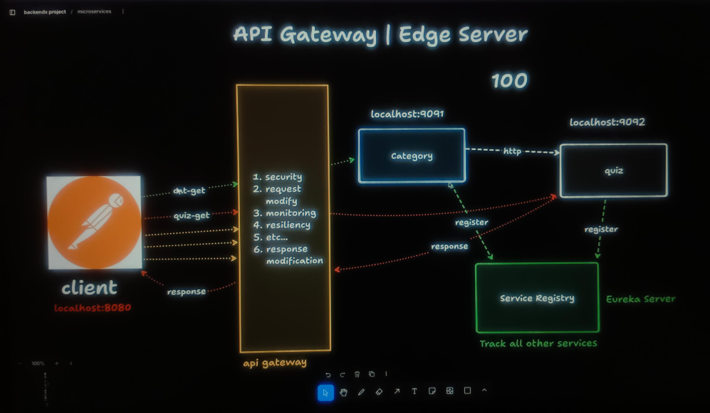
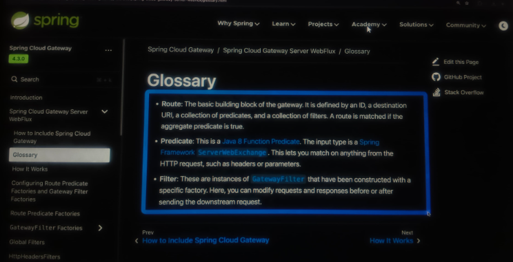

# API Gateway server

* When there are multiple instance and services are working then we have to remember all the header and port no.
* User call the goes to the **API Gateway** it will send it to the particular instance or service.
* It provides multiple functionality that can we perform at the **API Gateway**.
---------
* It will fetch the information from the **Service Registry**.
* API Gateway will do **default configurations** based on the info.
* it will happen when the application.properties is true

    spring.cloud.gateway.server.webflux.discovery.locator.enabled = true

### Depedencies

        <dependency>
			<groupId>org.springframework.cloud</groupId>
			<artifactId>spring-cloud-starter-netflix-eureka-client</artifactId>
        </dependency>

### application.properties

        
        spring.application.name=Api_Gateway_Server

        server.port=9093
        
        #eureka Configurations
        eureka.client.serviceUrl.defaultZone=http://localhost:8761/eureka
        eureka.client.fetch-registry = true
        eureka.client.registry-with-eureka = true
        
        #this will get the informations from  Service Registory(discovery)
        # this is very much important propety
        # this will allow to do default configuration 
        spring.cloud.gateway.server.webflux.discovery.locator.enabled = true
        
        
        # actuator Configuations
        management.endpoints.web.exposure.include=*
        management.endpoint.gateway.access=READ_ONLY
        
        #check here actuator
        #http://localhost:9093/actuator/gateway/routes

---------

# User Define Route

* We have to configure the:
  * Route
    * ID
    * URI
    * Predicate
    * Filter

### Two ways to configure :
    
    1. using Java
    2. application.properties or .yml

### application.properties 

      
      #eureka Configurations
      eureka.client.serviceUrl.defaultZone=http://localhost:8761/eureka
      eureka.client.fetch-registry = true
      eureka.client.register-with-eureka = true
      
      #this will get the information from  Service Registry(discovery)
      # this is very much important property
      # this will allow to do default configuration
      # NOTE : when we do User define routes then we have to make the default config = false
      spring.cloud.gateway.server.webflux.discovery.locator.enabled = false
      
      
      # actuator Configurations
      management.endpoints.web.exposure.include=*
      management.endpoint.gateway.enabled=true
      
      # Logging (to debug routes)
      logging.level.org.springframework.cloud.gateway=DEBUG
      
      #management.endpoint.gateway.access= READ_ONLY
      
      #check here actuator
      #http://localhost:9093/actuator/gateway/routes
