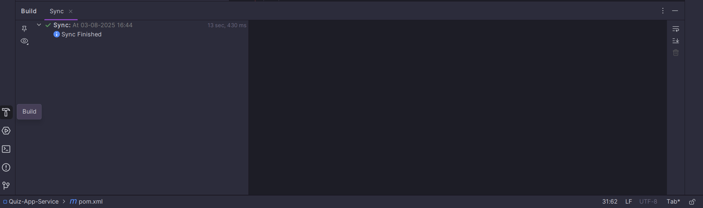

# Feign Client

* This provides the delacture aproch.
    * we dont hevt to write the code by own.
    * we are witing the code in the Rest Template and Web Client. 
    * Here we will use the annotations and Interfces 
* This made by the Netflix.
* Build in Load Balancer

## Pom.xml

* we have to add the depedencies in the pom.xml fiel
* Go to spring inatilizer and search the OpenFeign

    <dependency>
        <groupId>org.springframework.cloud</groupId>
        <artifactId>spring-cloud-starter-openfeign</artifactId>
    </dependency>

* We have to add two more things here

  * First
    * We have to define this also {spring-cloud.version}

        <dependencyManagement>
        <dependencies>
          <dependency>
            <groupId>org.springframework.cloud</groupId>
            <artifactId>spring-cloud-dependencies</artifactId>
            <version>${spring-cloud.version}</version>
            <type>pom</type>
            <scope>import</scope>
          </dependency>
        </dependencies>
      </dependencyManagement>

  * Second

      * add this line only <spring-cloud.version>2025.0.0</spring-cloud.version>

    <properties>
      <java.version>21</java.version>
    <spring-cloud.version>2025.0.0</spring-cloud.version>
    </properties>

### after doing this Reload the Maven

### Whole Pom.xml

      <?xml version="1.0" encoding="UTF-8"?>
        <project xmlns="http://maven.apache.org/POM/4.0.0" xmlns:xsi="http://www.w3.org/2001/XMLSchema-instance"
        xsi:schemaLocation="http://maven.apache.org/POM/4.0.0 https://maven.apache.org/xsd/maven-4.0.0.xsd">
        <modelVersion>4.0.0</modelVersion>
        <parent>
        <groupId>org.springframework.boot</groupId>
        <artifactId>spring-boot-starter-parent</artifactId>
        <version>3.5.3</version>
        <relativePath/> <!-- lookup parent from repository -->
        </parent>
        <groupId>quiz.QuizAppService</groupId>
        <artifactId>Quiz-App-Service</artifactId>
        <version>0.0.1-SNAPSHOT</version>
        <name>Quiz-App-Service</name>
        <description>Demo project for Spring Boot</description>
        <url/>
        <licenses>
        <license/>
        </licenses>
        <developers>
        <developer/>
        </developers>
        <scm>
        <connection/>
        <developerConnection/>
        <tag/>
        <url/>
        </scm>

        <properties>
          <java.version>21</java.version>
          <spring-cloud.version>2025.0.0</spring-cloud.version>
        </properties>

        <dependencies>
        <dependency>
        <groupId>org.springframework.boot</groupId>
        <artifactId>spring-boot-starter-data-mongodb</artifactId>
        </dependency>
        <dependency>
        <groupId>org.springframework.boot</groupId>
        <artifactId>spring-boot-starter-web</artifactId>
        </dependency>
        <dependency>
        <groupId>org.springframework.boot</groupId>
        <artifactId>spring-boot-starter-webflux</artifactId>
        </dependency>
        
                <dependency>
                    <groupId>org.springframework.cloud</groupId>
                    <artifactId>spring-cloud-starter-openfeign</artifactId>
                </dependency>
        
                <dependency>
                    <groupId>org.projectlombok</groupId>
                    <artifactId>lombok</artifactId>
                    <optional>true</optional>
                </dependency>
                <dependency>
                    <groupId>org.springframework.boot</groupId>
                    <artifactId>spring-boot-starter-test</artifactId>
                    <scope>test</scope>
                </dependency>
                <dependency>
                    <groupId>org.modelmapper</groupId>
                    <artifactId>modelmapper</artifactId>
                    <version>3.1.1</version>
                    <scope>compile</scope>
                </dependency>
            </dependencies>
        
            <dependencyManagement>
                <dependencies>
                    <dependency>
                        <groupId>org.springframework.cloud</groupId>
                        <artifactId>spring-cloud-dependencies</artifactId>
                        <version>${spring-cloud.version}</version>
                        <type>pom</type>
                        <scope>import</scope>
                    </dependency>
                </dependencies>
            </dependencyManagement>
        
            <build>
                <plugins>
                    <plugin>
                        <groupId>org.apache.maven.plugins</groupId>
                        <artifactId>maven-compiler-plugin</artifactId>
                        <configuration>
                            <annotationProcessorPaths>
                                <path>
                                    <groupId>org.projectlombok</groupId>
                                    <artifactId>lombok</artifactId>
                                </path>
                            </annotationProcessorPaths>
                        </configuration>
                    </plugin>
                    <plugin>
                        <groupId>org.springframework.boot</groupId>
                        <artifactId>spring-boot-maven-plugin</artifactId>
                        <configuration>
                            <excludes>
                                <exclude>
                                    <groupId>org.projectlombok</groupId>
                                    <artifactId>lombok</artifactId>
                                </exclude>
                            </excludes>
                        </configuration>
                    </plugin>
                </plugins>
            </build>
      
      </project>

## Now We have to Enable the Feign client.

  * We have to apply The Annotatios on the Configuration Class

    @SpringBootApplication
    @EnableFeignClients   // 👈👈👈👈👈👈👈 Annotations
    public class QuizAppServiceApplication
    {
        public static void main(String[] args) {
            SpringApplication.run(QuizAppServiceApplication.class, args);
        }
    }

## Implementing the Feign Client

* We are creating the CategoryFeignService.java
  * It is declarative aproch so we are creating the interface.

* We are testing the the findAll method in the Test.

  

      @SpringBootTest
      class QuizAppServiceApplicationTests {
      
          @Test
          void contextLoads() {
          }
      
          @Autowired
          CategoryFeignSercice categoryFeignSercice;
      
          @Test
          public  void testFeignGetAllCategories()
          {
              System.out.println("Getting All the categories");
      
              List<CategoryDto> list = categoryFeignSercice.findAll();
      
              list.forEach(categoryDto ->{
      
                  System.out.println(categoryDto.getTitle());
              });
          }
      
      }
