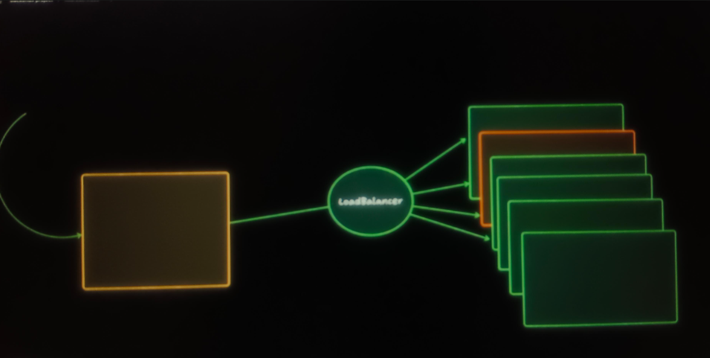
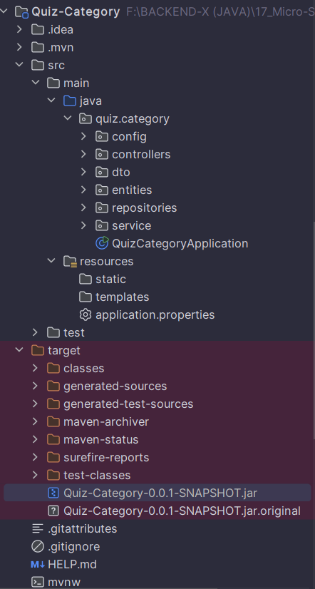
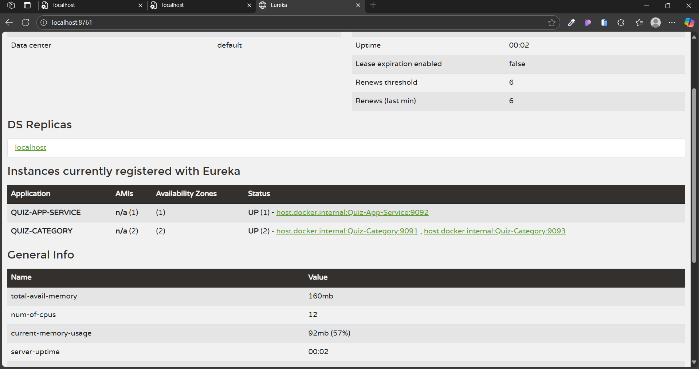

# Load Balancer 

### When there is multiple instances it will help to decide which instence we have to pick.

\

* we require just one **Annotations**

# @LoadBalancer On Rest Template

-----

## ProjectConfig.java (Quiz-App-Service)

    package quiz_App_Service.config;

    import org.modelmapper.ModelMapper;
    import org.springframework.cloud.client.loadbalancer.LoadBalanced;
    import org.springframework.cloud.openfeign.EnableFeignClients;
    import org.springframework.context.annotation.Bean;
    import org.springframework.context.annotation.Configuration;
    import org.springframework.web.client.RestTemplate;
    import org.springframework.web.reactive.function.client.WebClient;
    
    @Configuration
    @EnableFeignClients
    public class ProjectConfig
    {
        @Bean
        public ModelMapper modelMapper()
        {
        return new ModelMapper();
        }
    
        @Bean
        @LoadBalanced   // 👈👈👈👈👈👈👈
        public RestTemplate restTemplate() {
            return new RestTemplate();
        }
    
        @Bean
        public WebClient webClient()
        {
            return WebClient
                    .builder()
                    .baseUrl("http://localhost:9091")
                    .build();
        }
    }

-----------

## QuizServiceImpl.java (Quiz-App-Service)

    @Override
    public QuizDto create(QuizDto quizDto) 
    {

        Quiz quiz = modelMapper.map(quizDto, Quiz.class);
        quiz.setId(UUID.randomUUID().toString());

        //✅✅Note String url is commented here we used it for REST TEMPLATE ❌❌
        // We have SERVICE REGISTRATORY which maintain the urls for the servies
        // so wo dont have to provide the static URL's
        //And
        // now we are using Load Balancer

        // validate category:
        //String url = "http://localhost:9091/api/v1/categories/" + quizDto.getCategoryId();
        
        //❤️❤️ EUREKA are provide the URL in form of the  NAME of the Service
        //                  👇👇👇👇👇👇
        String url = "http://QUIZ-CATEGORY/api/v1/categories/" + quizDto.getCategoryId();
        logger.info(url);
        // call to category service
        CategoryDto category = restTemplate.getForObject(url, CategoryDto.class);
        logger.info("category exists: " + category.getTitle());

        Quiz savedQuiz = quizRepository.save(quiz);
        QuizDto quizDto1 = modelMapper.map(savedQuiz, QuizDto.class);
        quizDto1.setCategoryDto(category);
        return quizDto1;
        
    }

-------------------------------------------------------------------------------------
-----------------------------------

# @LoadBalancer On Web Client

## ProjectConfig.java (Quiz-App-Service)
            
        package quiz_App_Service.config;

        import org.modelmapper.ModelMapper;
        import org.springframework.cloud.client.loadbalancer.LoadBalanced;
        import org.springframework.cloud.openfeign.EnableFeignClients;
        import org.springframework.context.annotation.Bean;
        import org.springframework.context.annotation.Configuration;
        import org.springframework.web.client.RestTemplate;
        import org.springframework.web.reactive.function.client.WebClient;
        
        @Configuration
        @EnableFeignClients
        public class ProjectConfig
        {
            @Bean
            public ModelMapper modelMapper()
            {
            return new ModelMapper();
            }
            
            @Bean
            @LoadBalanced
            public RestTemplate restTemplate() {
                return new RestTemplate();
            }
        
            //---------------------------------------------------------------------------
            
            /// WEB CLIENT ne 1st time configure kar va we use this
            
            //    @Bean
            //    public WebClient webClient()
            //    {
            //        return WebClient
            //                .builder()
            //                .baseUrl("http://localhost:9091")
            //                .build();
            //    }
            //----------------------------------------------------------------------------
        
            
            ///✅✅ Now we have to apply the LOAD BALANCER to the WEB CLIET
            
            // we can't apply to Web Clint directly
            
            ///❤️❤️ we have to apply on WebCLient.Builer
        

            @Bean
            @LoadBalanced
            public WebClient.Builder webClient()
            {
                return WebClient.builder();
            }
        
        }

-----------------------------------

## QuixServiceImpl (Quiz-App-Service)

            package quiz_App_Service.service;

            import org.modelmapper.ModelMapper;
            import org.slf4j.Logger;
            import org.springframework.stereotype.Service;
            import org.springframework.web.client.RestTemplate;
            import org.springframework.web.reactive.function.client.WebClient;
            import org.springframework.web.reactive.function.client.WebClientResponseException;
            import quiz_App_Service.collections.Quiz;
            import quiz_App_Service.dto.CategoryDto;
            import quiz_App_Service.dto.QuizDto;
            import quiz_App_Service.repositories.QuizRepository;
            
            import java.util.List;
            import java.util.Locale;
            import java.util.UUID;
            
            @Service
            public class QuizServiceImpl implements QuizService 
            {

                private Logger logger = org.slf4j.LoggerFactory.getLogger(QuizServiceImpl.class);
            
                private final QuizRepository quizRepository;
            
                private final ModelMapper modelMapper;
            
                private final RestTemplate restTemplate;
            
                private final WebClient webClient;
            
                private final WebClient.Builder webClientBuilder;
            
                private final CategoryFeignSercice categoryFeignSercice;
            
                //constructor
                public QuizServiceImpl(QuizRepository quizRepository,
                                       ModelMapper modelMapper,
                                       RestTemplate restTemplate,
                                       WebClient.Builder webClientBuilder,
                                       CategoryFeignSercice categoryFeignSercice)
                {
            
                    this.quizRepository = quizRepository;
                    this.modelMapper = modelMapper;
                    this.restTemplate = restTemplate;
                    this.webClientBuilder = webClientBuilder;
                    this.categoryFeignSercice = categoryFeignSercice;
            
            
                    ///❤️❤️✅✅ here we are using UREKA for the passing the URl in form of the servide name.
                                                                //   👇👇👇👇👇👇👇    
                    this.webClient = webClientBuilder.baseUrl("http://QUIZ-CATEGORY").build();
            
                }
            
            
                @Override      ///  ✅✅ We use REST-TEMPLATE at here
                public QuizDto create(QuizDto quizDto) {
            
                    Quiz quiz = modelMapper.map(quizDto, Quiz.class);
                    quiz.setId(UUID.randomUUID().toString());
            
                    //✅✅Note String url is commented here we used it for REST TEMPLATE ❌❌
                    // We have SERVICE REGISTRATORY which maintain the urls for the servies
                    // so wo dont have to provide the static URL's
                    //And
                    // now we are using Load Balancer
            
            
                    // validate category:
                    //String url = "http://localhost:9091/api/v1/categories/" + quizDto.getCategoryId();
            
                    String url = "http://QUIZ-CATEGORY/api/v1/categories/" + quizDto.getCategoryId();
                    logger.info(url);
                    // call to category service
                    CategoryDto category = restTemplate.getForObject(url, CategoryDto.class);
                    logger.info("category exists: " + category.getTitle());
            
                    Quiz savedQuiz = quizRepository.save(quiz);
                    QuizDto quizDto1 = modelMapper.map(savedQuiz, QuizDto.class);
                    quizDto1.setCategoryDto(category);
                    return quizDto1;
            
                }
            
                @Override
                public QuizDto update(String quizId, QuizDto quizDto) {
                    Quiz quiz = quizRepository.findById(quizId).orElseThrow(() -> new RuntimeException("Quiz not found"));
                    quiz.setTitle(quizDto.getTitle());
                    quiz.setDescription(quizDto.getDescription());
                    quiz.setMaxMarks(quizDto.getMaxMarks());
                    quiz.setTimeLimit(quizDto.getTimeLimit());
                    quiz.setCreatedBy(quizDto.getCreatedBy());
                    quiz.setNoOfQuestions(quizDto.getNoOfQuestions());
                    quiz.setImageUrl(quizDto.getImageUrl());
                    quiz.setLive(quizDto.getLive());
                    quiz.setPassingMarks(quizDto.getPassingMarks());
                    quiz.setCategoryId(quizDto.getCategoryId());
                    Quiz updatedQuiz = quizRepository.save(quiz);
                    QuizDto quizDto1 = modelMapper.map(updatedQuiz, QuizDto.class);
                    return quizDto1;
            
            
                }
            
                @Override
                public void delete(String quizId) {
                    Quiz quiz = quizRepository.findById(quizId).orElseThrow(() -> new RuntimeException("Quiz not found"));
                    quizRepository.delete(quiz);
                }
            
                @Override     ///  ✅✅ We use WEB-CLIENT at here
                public List<QuizDto> findAll()
                {
                    ///  ✅❤️✅ We use WEB-CLIENT at here
            
                    List<Quiz> all = quizRepository.findAll();
            
                    List<QuizDto> quizDtoList = all.stream().map(quiz->{
            
                        String categoryID = quiz.getCategoryId();
                        QuizDto quizDto = modelMapper.map(quiz,QuizDto.class);
                            try
                            {
                                CategoryDto categorydto = this.webClient
                                        .get()
                                        .uri("/api/v1/categories/{categoryID}" , categoryID)
                                        .retrieve()
                                        .bodyToMono(CategoryDto.class)
                                        .block();
            
            
                                quizDto.setCategoryDto(categorydto);
                            }
                            catch (WebClientResponseException e)
                            {
                                e.printStackTrace();
                                quizDto.setCategoryDto(null);
                            }
                        return quizDto;
            
                    }).toList();
            
                    return quizDtoList;
                }
            
                @Override
                public QuizDto findById(String quizId) {
                    Quiz quiz = quizRepository.findById(quizId).orElseThrow(() -> new RuntimeException("Quiz not found"));
            
                    ///  ✅✅ We use REST-TEMPLATE at here
            
                    QuizDto quizDto = modelMapper.map(quiz, QuizDto.class);
                    String categoryId = quiz.getCategoryId();
                    String url = "http://QUIZ-CATEGORY/api/v1/categories/" + categoryId;
                    logger.info(url);
                    // call to category service
                    CategoryDto category = restTemplate.getForObject(url, CategoryDto.class);
                    quizDto.setCategoryDto(category);
                    return quizDto;
                }
            
                @Override     ///  ✅✅ We use FEIGN-CLIENT at here
                public List<QuizDto> findByCategory(String categoryId) {
                    List<Quiz> all = quizRepository.findByCategoryId(categoryId);
            
                    return all.stream().map(quiz -> {
            
                        QuizDto quizDto = modelMapper.map(quiz, QuizDto.class);
            
                        CategoryDto categoryDto = categoryFeignSercice.findById(quizDto.getCategoryId());
            
                        quizDto.setCategoryDto(categoryDto);
            
                        return quizDto;
            
                    }).toList();
            
            
                }
            }

------------------------------------------------------------------
-----------

# @LoadBalancer On Feign Client

### 1. Feign Client we don't have to write @Load Balancer
### 2. It provides autoconfiguration for the Load Balncer

## CategoryFeignService (Quiz-App-Service)

    
            package quiz_App_Service.service;

            import org.springframework.cloud.openfeign.FeignClient;
            import org.springframework.web.bind.annotation.*;
            import quiz_App_Service.dto.CategoryDto;
            
            import java.util.List;
            
            //❤️❤️ Just provide the EUREKA Service name
            //                  👇👇👇👇👇👇👇
            @FeignClient(name = "QUIZ-CATEGORY")
            public interface CategoryFeignSercice
            {
            
                @GetMapping("/api/v1/categories")
                List<CategoryDto> findAll();
            
                @GetMapping("/api/v1/categories/{categoryId}")
                CategoryDto findById(@PathVariable String categoryId );
            
                @DeleteMapping("/api/v1/categories/{categoryId}")
                String deleteById(@PathVariable String categoryId);
            
                @PutMapping("/api/v1/categories/{categoryId}")
                CategoryDto updateById(@PathVariable String categoryId , @RequestBody CategoryDto categoryDto);
            }

---------------------------------------------------------------------------------------------------------
------------

# How to create Multiple Instance of the Service 

### 1. je pn service no instance create kar vo hoi to ae service na maven ma jai ne 
        - LifeCycle
            |- package (click on it)

* It will build the .jar file of that service 

### 2. Where the jar file pesent ??

* ### Quiz-category-0.0.1-SNAPSHRT.jar
----------
 

### 3. Copy the jar file and I move it to download.

* Open the cmd from that file 
* I Renamed the file to the cat 
* using this command we can run.
* this server.port is provide because two instance don't get conflicted

         java -jar cat.jar -- server.port=9093

* another instance is running on the IntelliJ.

-----------

### 4. How to check where and how many Instance is Running ?

* this is running for the   EUREKA 
* it will tell how many instance is running 

        http://localhost:8761

* we can observe there are two instance of QUIZ CATEGORY

