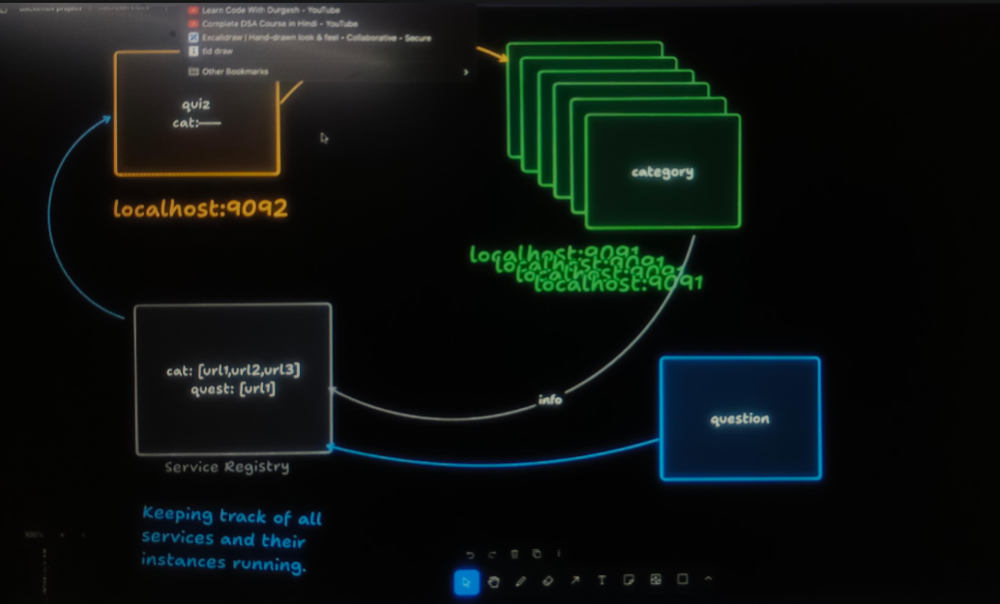

# Service Registory

---------

---------

# What is Use ?

* We are hard coding the URL in the Feign client for the interService communications.
* But in the real life we are using the microservices so, each have the different url.
* ### Sometimes neded then we have to create the multiple instance of the service.
* At that time, we have to provide **Dynamic URL's**.

* For this we will use Service Register which will manage all the 
  * Service URI's for the perticular service and for the multiple instances also.

* ## It will behave like a server

* ## Depedencies : Eureka Server
  * Create the new project of the Service Registory 
  * using spring inaatializer
  * depedencies : only Eureka Server

* ## Other Services like Quiz , Category will behave like Client

* ## Eureka Discovery Client  (Depedencies)
  * For The **client** we will use  

* First we have to delete application.properties
* Second create application.yml file 

## application.yml

    server:
      port: 8761
      
    spring:
      application:
        name: service-registry
        
    eureka:
      client:
        register-with-eureka: false    # we use false because server can't register itself as client
        fetch-registry: false          # we use false because server can't fetch the data from itself
          
    
## main.java

    @SpringBootApplication
    @EnableEurekaServer           //👈👈 ADD THIS ANNOTATIONS 👈👈
    public class ServiceRegistoryApplication {

        public static void main(String[] args) {
            SpringApplication.run(ServiceRegistoryApplication.class, args);
        }
    
    }

# How to add the Clients (Service):

### 1. add the given depedencies in the pom.xml
* for the depedencies we required the version and the depedencyManagement
    
        <properties>
          <java.version>21</java.version>
          <spring-cloud.version>2025.0.0</spring-cloud.version>
        </properties>  

--------------

          <dependencyManagement>
              <dependencies>
                  <dependency>
                      <groupId>org.springframework.cloud</groupId>
                      <artifactId>spring-cloud-dependencies</artifactId>
                      <version>${spring-cloud.version}</version>
                      <type>pom</type>
                      <scope>import</scope>
                  </dependency>
              </dependencies>
          </dependencyManagement>

### 2. Add the annotation to the psvm() class

* **@EnableDiscoveryClient**

### 3. add the line to the application.properties

* eureka.client.serviceUrl.defaultZone=http://localhost:8761/eureka

## Depedencies 

* ### add this to the services like : quiz , cetegory
    

    <dependency>
        <groupId>org.springframework.cloud</groupId>
        <artifactId>spring-cloud-starter-netflix-eureka-client</artifactId>
    </dependency>

* ## add the @EnableDiscoveryClient to the main.java of client (service).

      @SpringBootApplication
      @EnableFeignClients
      @EnableDiscoveryClient     // 👈👈👈👈👈
      public class QuizAppServiceApplication
      {
      
          public static void main(String[] args) {
              SpringApplication.run(QuizAppServiceApplication.class, args);
          }
      
      
      }

* ## add the line to application.properties
  

    spring.application.name=Quiz-App-Service
    server.port=9092
    
    #db connection
    spring.data.mongodb.uri=mongodb://localhost:27017/quizdb
    
    #👇👇👇👇👇
    eureka.client.serviceUrl.defaultZone=http://localhost:8761/eureka
    
