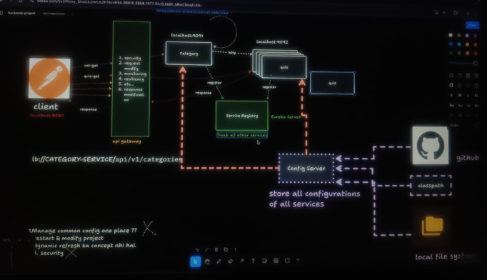

# Config Server

* running on the port 9094

### Working :

* we have multiple serices in the project 
* for that they have multiple applications.properties files 
* it is difficult to maintain for the different services

* here comes up and Config server which help to maintain the properties.
* there are ***3-Ways to store properties***

    1. Github
    2. Class Path
    3. Local file system

### Depedencies 

* Config Server
* Spring Boot Actuator
* Eureka Discovery Client
* Config Client

## main()
        @SpringBootApplication
        @EnableConfigServer    //👈👈👈👈👈 ANNOTATION 
        public class ConfigServerApplication 
        {
    
            public static void main(String[] args) {
                SpringApplication.run(ConfigServerApplication.class, args);
            }
    
        }

## application.properties

    spring.application.name=config-server
    server.port=9094

    # config server :
    spring.cloud.config.server.native.search-lacations=classpath:/config
    spring.profiles.active=native
    
    # eureka configurations
    eureka.client.serviceUrlZone=http://localhost:8761/eureka
    eureka.client.fetch-registry=true
    eureka.client.register-with-eureka=true

-----------------
### ✅ We have to create the Config folder in the resource folder.

* We will add the other services application.properties of .yml file in this folder
    resource
      |- config
            |- Quiz-App-Service.properties
            |- Quiz-Category.properties

--------

### ✅ How to check Config Server is getting the configurations ??

* Here we can access the config file.
* now we have to pass/ allow other services to access. 

* http://localhost:9094/category-service/default

* http://localhost:9094/quiz-app-service/default

-----------

## ❤️❤️ Now, How the Category, Quiz service can get the properties from the Config Server ??

* This ***Dependencies Must be their*** in the Quiz , Category ...

  * Config Client 

      <dependency>
        <groupId>org.springframework.cloud</groupId>
        <artifactId>spring-cloud-starter-config</artifactId>
      </dependency>

----------

# 1. Class Path

### 🔥🔥now add the below line in the application.properties of the quiz,category services

    spring.config.import=optional:configserver:http://localhost:9094

* ***application.properties*** of the ****config-server**** 

        spring.application.name=config-server
        server.port=9094

        # config server (class path): 👈
        spring.profiles.active=native
        spring.cloud.config.server.native.search-locations=classpath:/config
        
        
        # eureka configurations
        eureka.client.serviceUrlZone=http://localhost:8761/eureka
        eureka.client.fetch-registry=true
        eureka.client.register-with-eureka=true

--------------------

# 2. GitHub

* create the new github repo(public).
* now all the .properties in the config folder added to the repo.

* ***check here :***

* http://localhost:9094/category-service/default
* http://localhost:9094/quiz-app-service/default

        
### application.properties (config-server)
        spring.application.name=config-server
        
        server.port=9094

        # config server (class path):
        
        #spring.profiles.active=native
        #spring.cloud.config.server.native.search-locations=classpath:/config
        

        # config server (github):  👈👈👈👈
        spring.cloud.config.server.git.uri=https://github.com/TirthChapla/backendX-microservices-config-server
        spring.cloud.config.server.git.default-label=main
        spring.cloud.config.server.git.clone-on-start=true
        

        # eureka configurations
        eureka.client.serviceUrlZone=http://localhost:8761/eureka
        eureka.client.fetch-registry=true
        eureka.client.register-with-eureka=true
        
